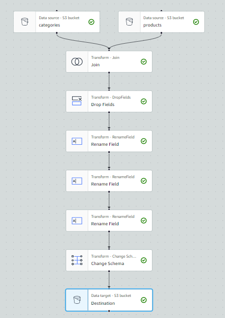

# Data Pipeline - Amazon Products

## Problem statement
We have a dataset that was scrapped from the internet in Sep 2023, which includes Amazon products' prices and sales. You are tasked to extract the data information and upload them to BigQuery. It is also required to develop a dashboard to visulize the data to the users.
The data is from [kaggle](https://www.kaggle.com/datasets/asaniczka/amazon-products-dataset-2023-1-4m-products).

## Requirements
1. Data Extraction from data sources, such as databases, csv files, or APIs.
2. Data masking: If sensitive information exist
3. Data loading to BigQuery: Design a process to securely load the data to google storage bucket and BigQuery (Batching or Streaming)
4. Transform the data
5. Dashboard Visulization (need 2 tiles)

## Data Pipeline Mapping

## Google Cloud
1. Composer - create environment - create a name - check the box to grant the permission - keep the rest as default or choose as you need
    **You might also need add more IAM roles in the service account, add composer admin, data fusion admin, and choose a different region due to quota constraint**
2. Data Fusion - create a name - keep default setting
3. create a bucket

## Extract data
1. download the csv file from [kaggle](https://www.kaggle.com/datasets/asaniczka/amazon-products-dataset-2023-1-4m-products)
2. convert explore.ipynb to py file `jupyter nbconvert --to script your_notebook.ipynb`
3. complete the script that uploads the file to GCS
4. Set the Environment Variable: `export GOOGLE_APPLICATION_CREDENTIALS=/path/to/your/key-file.json`
5. Verify the Configuration: `echo $GOOGLE_APPLICATION_CREDENTIALS`
6. Use the gcloud SDK with the Service Account: `gcloud auth activate-service-account --key-file=$GOOGLE_APPLICATION_CREDENTIALS`
7. run `python3 extract.py` to upload the csv file to bucket

8. **3 csv files have not been pushed to the repo**

## Data Fusion (Transformation)
1. go to the data fusion instance -> authorize
2. choose what you would like to do

3. choose wrangle or others
4. connect to the file in GCS bucket (you might need to add connection if the connection is not available in the default)
5. set up the parsing options -> csv/use first row as header/enable quoted value
6. Transform the data: clean data/ update data types ...

7. Create a Pipeline

8. choose a sink (BigQuery)

9. create a new dataset in BigQuery
10. set up the BigQuery property

11. use "validate" button to check whether there is an error
12. name your pipeline and deploy it

13. pipeline created
