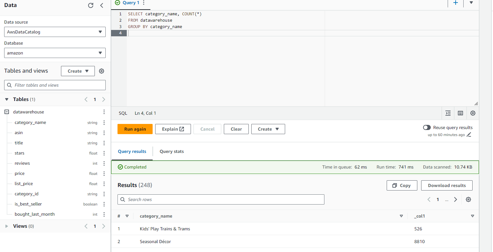

# Data Pipeline - Amazon Products

## Problem statement
We have a dataset that was scrapped from the internet in Sep 2023, which includes Amazon products' prices and sales. You are tasked to extract the data information and upload them to AWS. It is also required to develop a dashboard to visulize the data to the users.
The data is from [kaggle](https://www.kaggle.com/datasets/asaniczka/amazon-products-dataset-2023-1-4m-products).

## Requirements
1. Data Extraction from data sources, such as databases, csv files, or APIs.
2. Data loading to AWS bucket
3. Transform the data using AWS Glue, saving the parquet file in AWS bucket
4. Query the data using AWS Athena, saving the query results in bucket
5. Import the query results and use Tableau Dashboard Visulization

## Data Pipeline Mapping

## Download data
1. download the csv file from [kaggle](https://www.kaggle.com/datasets/asaniczka/amazon-products-dataset-2023-1-4m-products)
2. **csv files have not been pushed to the repo**

## AWS
1. Make sure to create IAM user to run the project
2. attach s3 full access, glue, athena, quicksight access to the user

## Create s3 bucket
1. create a bucket based on your region
2. create 2 folders in the bucket (stagging/datawarehouse)

## Upload the csv files
1. upload the files to stagging folder

## AWS Glue: transform & transfer the data to datawarehouse folder
1. search glue - Visual ETL
2. create job - Visual ETL
3. choose the source

4. set up data source

5. transforms (join/drop columns/change column name/update schema)

6. targets bucket                   

7. need to create a role that let glue call aws services, attached s3 full access policy
8. set up the properties and save
9. run the pipeline

10. transfer the data to bucket in parquet format

## Crawlers
1. create a crawler
2. add data sources (datawarehouse folder)
3. add IAM role (choose **AWSGlueServiceRole-xx**)
4. create a database and use it as the target database
5. hit create crawler
6. run crawler
7. a table is created

## Athena (Query)
1. choose "Analyze your data using PySpark and Spark SQL" Launch notebook editor
2. Query editor - settings - manage - Query result location (create a new bucket for it)
3. do the sql query and it returns the result and the file saved in the bucket

## Tableau Public
1. sign up Tableau public
2. upload the athena query results
3. build your dashboard

.png>)

[Tableau Report](https://public.tableau.com/views/AmazonSalesAug2023/AmazonSalesAug2023?:language=en-US&:sid=&:display_count=n&:origin=viz_share_link)