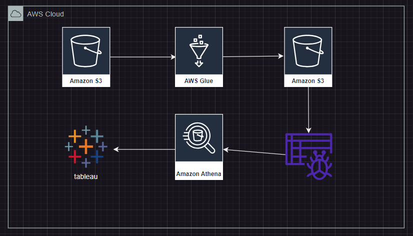

# Data Pipeline - Amazon Products

## Problem statement
We have a dataset that was scrapped from the internet in Sep 2023, which includes Amazon products' prices and sales. You are tasked to extract the data information and upload them to BigQuery. It is also required to develop a dashboard to visulize the data to the users.
The data is from [kaggle](https://www.kaggle.com/datasets/asaniczka/amazon-products-dataset-2023-1-4m-products).

## Requirements
1. Data Extraction from data sources, such as databases, csv files, or APIs.
2. Data masking: If sensitive information exist
3. Data loading to BigQuery: Design a process to securely load the data to google storage bucket and BigQuery (Batching or Streaming)
4. Transform the data
5. Dashboard Visulization (need 2 tiles)

## Data Pipeline Mapping

## Download data
1. download the csv file from [kaggle](https://www.kaggle.com/datasets/asaniczka/amazon-products-dataset-2023-1-4m-products)
2. **csv files have not been pushed to the repo**

## AWS
1. Make sure to create IAM user to run the project
2. attach s3 full access, glue, athena, quicksight access to the user

## Create s3 bucket
